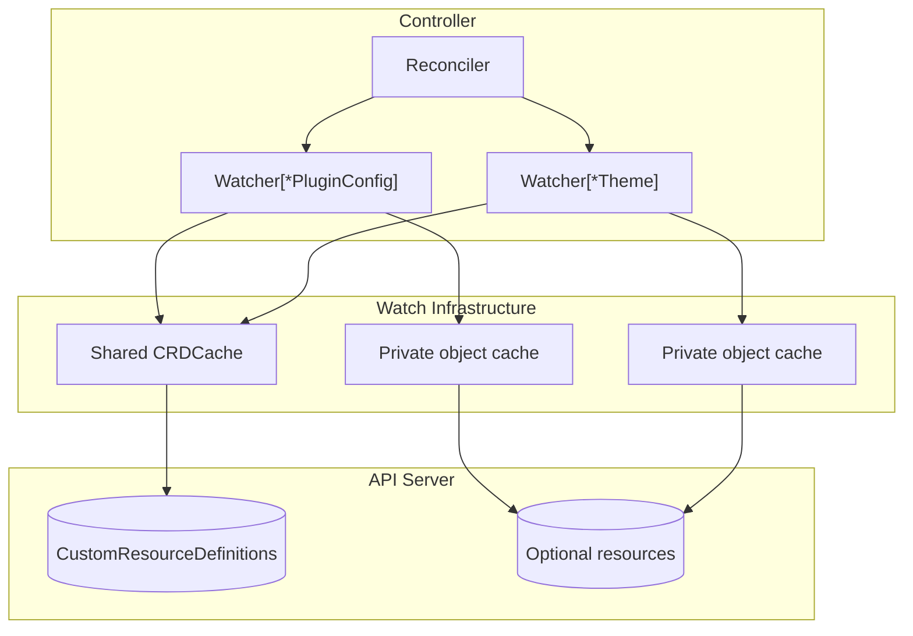
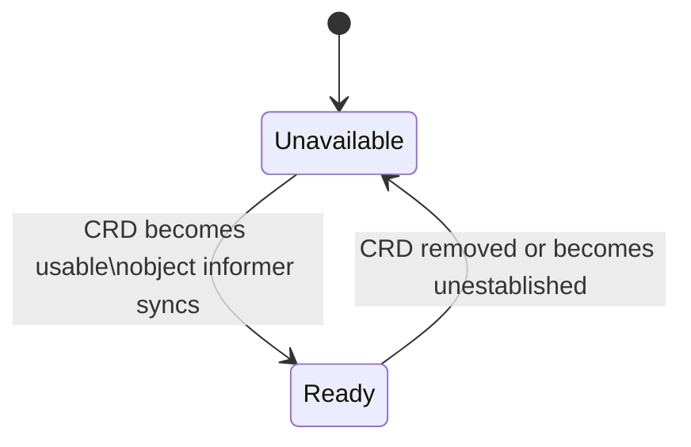

# Architecture

## Problem

Controllers often depend on CRDs that may or may not exist in the cluster.
A startup-only availability check creates two bad outcomes:

- if the CRD is installed later, the controller needs a restart before it can use it
- if the CRD is removed, an existing informer can keep retrying list/watch against an API that no longer exists

This PoC treats optional CRDs as things that can come and go while the controller runs, not as fixed startup assumptions.

## System Overview

`dynamicwatch` uses one `Watcher[T]` per optional CRD. Each watcher observes the lifecycle of a single CRD and only keeps an informer for `T` running while that CRD is usable.

The main architectural choices are:

- one watcher per optional integration, so each CRD lifecycle is independent
- one private object cache per watcher, so tearing an informer down never affects another controller watching the same GVK
- one shared `CRDCache` when you want to reuse a single CRD informer across many watchers

If `WithCRDCache` is omitted, a watcher creates its own dedicated CRD cache instead.

## Lifecycle

Each watcher moves between two user-visible states:

- **Unavailable**: the CRD is absent, deleting, not yet established, or the object informer is still syncing. `TryGet` and `TryList` return `(false, nil)`.
- **Ready**: the object informer is synced and safe to read from.

When a CRD appears, the watcher requeues affected parents. Their reconcile calls `Ensure()` (the first thing in each reconcile path), which starts the dynamic watch. Once the object cache syncs, parents are requeued again so they can read from the now-ready cache. When the CRD disappears, the watcher tears the informer down and returns to `Unavailable`.

## Example In This Repo

`internal/controller/widget_controller.go` wires two independent watchers - `Watcher[*PluginConfig]` and `Watcher[*Theme]` - sharing one `CRDCache`. One optional integration can flap without disturbing the other.

## Related Docs

- `README.md` shows how to wire the watcher into a controller and how the reconcile loop consumes it.
- `TECHNICAL_DESIGN.md` explains the design rationale, concurrency invariants, and known limitations.
- `DEV.md` covers local development and test modes.
- `MIGRATION.md` explains the controller-runtime version constraints this pattern depends on.
