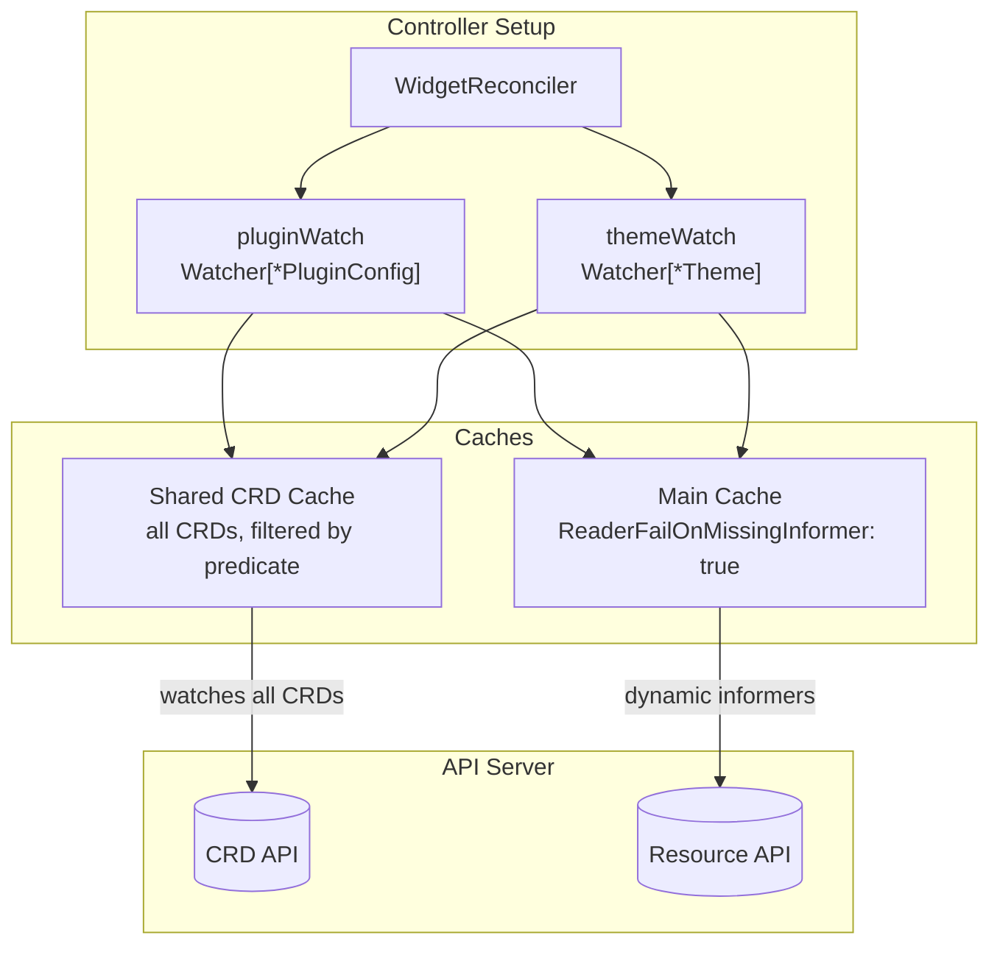
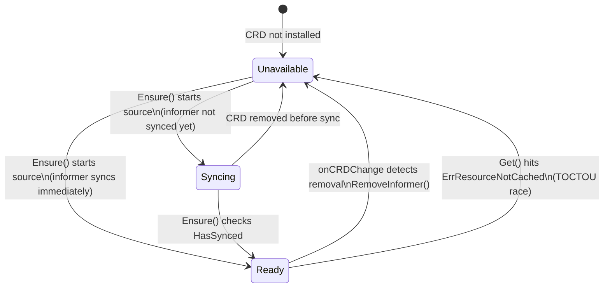

# Architecture

## The Problem

Kubernetes controllers that depend on optional CRDs have a startup problem. Most controllers check CRD availability once during initialization. Install the CRD later? Restart the controller. Remove it? The informer leaks, retrying list/watch against a dead API forever.

This gets worse when you have *multiple* optional CRDs. Think of a platform controller that optionally integrates with KEDA, Prometheus Operator, or Istio - each may or may not be installed, and any of them could appear or vanish at runtime.

The `dynamicwatch` package solves this: one `Watcher[T]` per optional CRD, each tracking its own CRD's lifecycle - registering informers when the CRD appears, tearing them down when it disappears. No restarts.

## How It Fits Together



The Widget controller owns two Watchers that share a single `CRDCache`. The shared cache watches all CRDs; each Watcher adds a `crdNamePredicate` so it only reacts to events for its own CRD. When a Watcher detects its CRD appearing, it registers an informer on the main cache for the actual resource type. When the CRD disappears, it tears that informer down.

If you prefer isolation (or don't want to create a shared cache), omit `WithCRDCache` and each Watcher creates a dedicated cache with a server-side field selector on `metadata.name` instead.

## Watcher Lifecycle

Each Watcher moves through three states, driven by CRD events and reconcile calls:



- **Unavailable** - CRD is not installed, or the watch was torn down after removal.
- **Syncing** - `Ensure()` started a `source.Kind` but the informer hasn't completed its initial list yet. Callers should requeue with a short delay. If the informer syncs fast enough, `Ensure()` skips this state entirely and goes straight to `Ready`.
- **Ready** - informer is synced and serving reads. `Available()` returns true. Business as usual.

## Building a Watcher

A Watcher is built with a fluent API that mirrors controller-runtime's builder:

```go
crdCache, _ := dynamicwatch.NewCRDCache(mgr)

w, err := dynamicwatch.For[*v1alpha1.PluginConfig](mgr, "pluginconfigs.demo.example.com").
    WithCRDCache(crdCache).                            // optional: share one CRD informer
    EnqueueOnObjectChange(r.pluginConfigToWidgets).     // PluginConfig created/updated/deleted
    EnqueueOnCRDChange(r.allWidgetsWithPluginRef).      // CRD itself appears/disappears
    Build()
```

The Watcher implements `source.SyncingSource`, so it plugs directly into the controller builder:

```go
ctrl.NewControllerManagedBy(mgr).
    For(&v1alpha1.Widget{}).
    WatchesRawSource(w).
    Complete(r)
```

The controller framework calls `Start` and `WaitForSync` automatically. No `Register`/`Bind` dance, no need to call `Build(r)` instead of `Complete(r)`.

## Using a Watcher in Reconcile

This is the part you'll actually copy-paste. During reconciliation, call `Ensure()` to check CRD availability and register the watch if needed, then `Get()` to read through the cache:

```go
switch r.pluginWatch.Ensure(ctx) {
case dynamicwatch.Syncing:
    return ctrl.Result{RequeueAfter: 200 * time.Millisecond}, nil
case dynamicwatch.Unavailable:
    widget.MarkPluginCRDNotAvailable()
    return ctrl.Result{}, nil
case dynamicwatch.Ready:
    // proceed
}

plugin := &v1alpha1.PluginConfig{}
if err := r.pluginWatch.Get(ctx, key, plugin); err != nil {
    if errors.Is(err, dynamicwatch.ErrCacheInvalidated) {
        return ctrl.Result{RequeueAfter: time.Second}, nil  // race - requeue
    }
    return ctrl.Result{}, err
}
```

`Available()` is also there if you need a quick point-in-time check - useful for health endpoints or metrics. It's a snapshot though, so don't use it for control flow in reconcile.

## Key Design Decisions

These are the things that broke along the way. Each one cost at least an hour of staring at goroutine dumps.

### Shared CRD cache with client-side predicates

The `CRDCache` type lets multiple Watchers share a single CRD informer instead of each opening its own LIST/WATCH connection:

```go
crdCache, _ := dynamicwatch.NewCRDCache(mgr)

pluginWatch, _ := dynamicwatch.For[*v1alpha1.PluginConfig](mgr, pluginCRDName).
    WithCRDCache(crdCache).
    // ...
    Build()

themeWatch, _ := dynamicwatch.For[*v1alpha1.Theme](mgr, themeCRDName).
    WithCRDCache(crdCache).
    // ...
    Build()
```

The shared cache watches all CRDs. Each Watcher adds a `crdNamePredicate` that filters events client-side by `crd.Name`. The PluginConfig Watcher doesn't react to Theme CRD events and vice versa.

A `stripCRDSpec` transform removes the OpenAPI schema from cached CRD objects before they hit the informer store - CRD specs can be large, and we only need metadata (name, deletionTimestamp) and status (Established condition).

If you omit `WithCRDCache`, each Watcher creates a dedicated cache with a server-side field selector as a fallback. Works fine, just costs an extra connection per Watcher. Note that the per-watcher fallback doesn't apply `stripCRDSpec` - it only watches one CRD anyway, so memory isn't really a concern.

### Closure-based lifecycle capture

Inside `Start`, the Watcher captures the controller's context and queue in a closure rather than storing them as struct fields:

```go
func (w *Watcher[T]) Start(ctx context.Context, queue workqueue.TypedRateLimitingInterface[reconcile.Request]) error {
    w.startSource = func(src source.SyncingSource) error {
        return src.Start(ctx, queue)
    }
    // ... start CRD source
}
```

This avoids storing a `context.Context` as a struct field (a Go anti-pattern flagged by `containedctx`). When `Ensure` needs to start an object source later at runtime, it calls `w.startSource(src)` - the closure already has everything it needs.

### `ReaderFailOnMissingInformer` is not optional

The main cache **must** have `ReaderFailOnMissingInformer: true`. Without it, a `Get()` call after `RemoveInformer()` silently creates a *new* informer for the removed GVK. That informer tries to list/watch against a non-existent API and blocks on `WaitForCacheSync` forever. Your controller worker goroutine is now permanently stuck. Ask me how I know.

With this flag, `Get()` returns `ErrResourceNotCached` instead, which `Watcher.Get()` translates to `ErrCacheInvalidated` - a clean signal to requeue.

`Build()` probes the manager's cache at construction time and returns a clear error if the flag isn't set. You find out at startup, not at 3 AM in production.

### CRD deletion race

This one is subtle (and took the longest to track down). During CRD deletion, Kubernetes updates the CRD status *before* setting `DeletionTimestamp`. The status update sets `Established=False` and fires a watch event. If you only check `DeletionTimestamp`, that status update event looks like a normal CRD update - the controller re-registers the watch mid-deletion, creating an informer that deadlocks on `WaitForCacheSync`.

The fix checks both signals:

```go
crdRemoved := !crd.DeletionTimestamp.IsZero() || !isCRDEstablished(crd)
```

### Event-driven CRD availability

CRD availability is tracked via an event-driven flag (`crdExists`) set by `onCRDChange` - no discovery API calls needed. A CRD source (started in `Start`) watches for CRD events and flips the flag. `WaitForSync` ensures the CRD informer has synced before workers start, so `crdExists` is accurate from the very first reconcile.

This is cheaper than polling the discovery API and eliminates the ~10 minute cache TTL problem that comes with cached discovery clients.

### TOCTOU between `Ensure()` and `Get()`

There's an inherent race: the CRD could be removed between `Ensure()` returning `Ready` and the subsequent `Get()` call. When this happens, `RemoveInformer` fires from `onCRDChange`, and `Get()` hits `ErrResourceNotCached`.

`Watcher.Get()` catches this, resets its internal state, and returns `ErrCacheInvalidated`. The caller requeues, and the next `Ensure()` sees `Unavailable`. No deadlock, no panic - just a clean retry. (This race is rare in practice but trivial to hit in tests with rapid CRD install/remove cycles.)

### `RemoveInformer` outside the mutex

`onCRDChange` acquires the mutex to flip state flags (`watching`, `active`, `crdExists`), then releases it before calling `RemoveInformer`. Holding the mutex during a potentially blocking cache operation would risk deadlocks. This is safe because controller-runtime's internal informer map has its own lock, and `Get`'s `ErrResourceNotCached` handling serves as a safety net for any race between `RemoveInformer` and concurrent `Ensure`/`Get` calls.

## The Example Controller

The Widget reconciler demonstrates the pattern with two independent optional CRDs:

- **Widget** (always installed) - the primary resource, has optional `pluginRef` and `themeRef` fields
- **PluginConfig** (optional) - provides a `setting` value
- **Theme** (optional) - provides a `colorScheme` value

Each optional CRD gets its own Watcher, its own status condition (`PluginReady` / `ThemeReady`), and its own set of mapper functions. The two Watchers share a single `CRDCache` but don't know about each other - you can install PluginConfig without Theme and vice versa. That's the whole point.

Condition management lives on the Widget type itself (methods like `MarkPluginApplied()`, `MarkThemeCRDNotAvailable()`, `RemovePluginCondition()`). Conditions are removed entirely when the corresponding ref field is cleared.

## Testing Strategy

Tests use envtest with Ginkgo v2 and run in three modes:

| Mode | What it tests | How to run |
|------|--------------|------------|
| envtest (default) | In-process manager + embedded apiserver | `make test` |
| USE_EXISTING_CLUSTER | In-process manager + real cluster | `make test-int` |
| DEPLOYED_MANAGER | Deployed pod + real cluster (full e2e) | `make test-e2e` |

Key testing details:

- **Only Widget CRD installed at startup.** PluginConfig and Theme CRDs are installed and removed dynamically during tests to exercise the full lifecycle.
- **`directClient` bypasses the manager cache.** CRD operations (install/remove) use an uncached client because the manager's cache has `ReaderFailOnMissingInformer: true` and CRD informers live in each Watcher's dedicated cache.
- **Unit tests use the export_test.go pattern.** White-box test helpers like `SetStarted`, `SetCRDExists`, `SimulateCRDChange`, and `SetStartSource` live in `export_test.go` so the black-box tests in `watcher_test.go` can exercise internal state transitions without coupling to struct layout.
- **Concurrency is tested explicitly.** Concurrent `Ensure` + `onCRDChange` and concurrent `Get` + `onCRDChange` tests run with `-race` to verify the mutex and closure-based lifecycle handling.
- **Lifecycle is the test.** The interesting tests are the dynamic ones: CRD not available, CRD install at runtime, CRD removal, add/remove/re-add cycle, rapid remove/reinstall, shared CRDCache isolation, and both Watchers operating simultaneously with independent conditions. If you can install and remove a CRD three times without the controller hanging, you're in good shape.

## Project Layout

```
pkg/dynamicwatch/
    watcher.go           # Watcher type, builder, CRDCache, CRD lifecycle management
    watcher_test.go      # Black-box unit tests with fake cache and informer
    helpers_test.go      # White-box unit tests for unexported helpers
    export_test.go       # Test helpers (state injection, CRD event simulation)

internal/controller/
    widget_controller.go            # Reconciler + SetupWithManager wiring
    widget_controller_test.go       # Unit tests for unexported helpers (mergeResults)
    widget_controller_int_test.go   # Integration tests (envtest / real cluster)
    dynamicwatch_int_test.go        # Integration tests for Build() validation
    suite_int_test.go               # Test suite setup (envtest, cluster modes)

testing/fixture/
    builders.go          # Test resource builders (Widget, PluginConfig, Theme)
    matchers.go          # Custom Gomega matchers for status conditions
    project.go           # ProjectRoot helper

api/v1alpha1/
    widget_types.go       # Widget CRD (primary)
    widget_lifecycle.go   # Condition management methods
    pluginconfig_types.go # PluginConfig CRD (optional)
    theme_types.go        # Theme CRD (optional)
```

The best starting point is `pkg/dynamicwatch/watcher.go` - that's where all the interesting decisions live. The controller in `internal/controller/` is intentionally boring. If consuming the library is boring, the library is doing its job.
