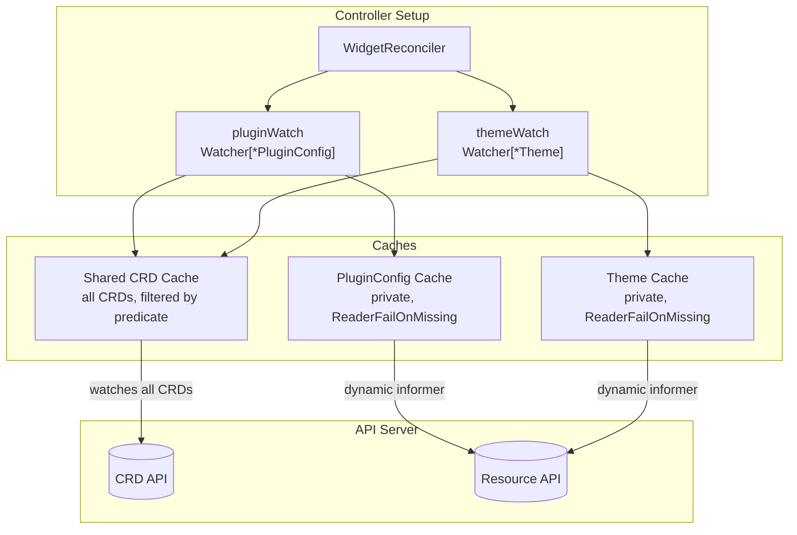
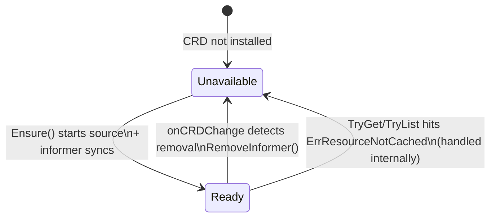

# Architecture

## The Problem

Kubernetes controllers that depend on optional CRDs might have a startup problem - most simply check CRD availability once during initialization. 

If you install the CRD later, you need to restart the controller. 

If you remove it - the informer might start leaking, retrying list/watch against a dead API forever.

This gets worse when you have *multiple* optional CRDs. Think of a platform controller that optionally integrates with KEDA, Prometheus Operator, or Istio - each may or may not be installed, and any of them could appear (or sometimes vanish) at runtime.

The `dynamicwatch` package solves this by introducing simple `Watcher[T]` per optional CRD, each tracking its own CRD's lifecycle - registering informers when the CRD appears, tearing them down when it disappears. No restarts needed.

## How It Fits Together



Two Watchers share a single `CRDCache`. The shared cache watches all CRDs; each Watcher filters events client-side via `crdNamePredicate`. When a CRD appears, the Watcher registers an informer on its private object cache. When it disappears, it tears the informer down. Private caches keep Watchers isolated - removing an informer from one never affects the other.

Omit `WithCRDCache` and each Watcher creates a dedicated cache with a server-side field selector instead.

## Watcher Lifecycle

Each Watcher has two states:



- **Unavailable** (`Ensure()` returns `false`) - CRD not installed, watch torn down, or informer still syncing. When a new watch is registered, it waits for sync and auto-requeues affected parents.
- **Ready** (`Ensure()` returns `true`) - informer synced, cache serving reads.

## Building a Watcher

```go
crdCache, _ := dynamicwatch.NewCRDCache(mgr)

w, err := dynamicwatch.For[*v1alpha1.PluginConfig](mgr, "pluginconfigs.demo.example.com").
    WithCRDCache(crdCache).
    WithEventHandler(handler.TypedEnqueueRequestsFromMapFunc(r.pluginConfigToWidgets)).
    EnqueueOnCRDChange(r.allWidgetsWithPluginRef).
    Build()
```

For owned resources (the dynamic equivalent of `builder.Owns()`), use `EnqueueForOwner` instead:

```go
routeWatch, err := dynamicwatch.For[*networkingv1.HTTPRoute](mgr, "httproutes.gateway.networking.k8s.io").
    WithCRDCache(crdCache).
    EnqueueForOwner(&v1alpha1.Widget{}, handler.OnlyControllerOwner()).
    WithPredicates(predicate.GenerationChangedPredicate{}).
    EnqueueOnCRDChange(r.allWidgets).
    Build()
```

Pick one - `WithEventHandler` or `EnqueueForOwner`. `WithPredicates` works with both.

The Watcher plugs directly into the controller builder:

```go
ctrl.NewControllerManagedBy(mgr).
    For(&v1alpha1.Widget{}).
    WatchesRawSource(w).
    Complete(r)
```

## Using a Watcher in Reconcile loop

```go
plugin := &v1alpha1.PluginConfig{}
available, err := r.pluginWatch.TryGet(ctx, key, plugin)
if err != nil {
    if client.IgnoreNotFound(err) == nil {
        widget.MarkPluginNotFound(widget.Spec.PluginRef)
        return ctrl.Result{}, nil
    }
    return ctrl.Result{}, err
}
if !available {
    widget.MarkPluginCRDNotAvailable()
    return ctrl.Result{}, nil
}
```

`TryGet` calls `Ensure` internally and absorbs `ErrResourceNotCached` races, returning `(false, nil)` instead. Callers never see cache invalidation errors.

## Key Design Decisions

### Private object cache per Watcher

Each Watcher creates its own `cache.Cache` for type T, separate from the manager's shared cache. Without this, two controllers in the same manager watching the same optional GVK (e.g. `KnativeService` watched by both `InferenceServiceReconciler` and `InferenceGraphReconciler`) would break each other - one controller's `RemoveInformer` kills the informer for both.

The private cache uses `ReaderFailOnMissingInformer: true`. Without this flag, `Get()` after `RemoveInformer()` silently creates a *new* informer that tries to list/watch a dead API and blocks forever. With it, you get `ErrResourceNotCached`, which `TryGet`/`TryList` absorb as `(false, nil)`.

### CRD deletion race

During CRD deletion, Kubernetes updates CRD status *before* setting `DeletionTimestamp`. The status update sets `Established=False` and fires a watch event. If you only check `DeletionTimestamp`, that event looks like a normal CRD update - the controller re-registers the watch mid-deletion, creating an informer that deadlocks on `WaitForCacheSync`.

The fix checks both signals:

```go
crdRemoved := !crd.DeletionTimestamp.IsZero() || !isCRDEstablished(crd)
```

### TOCTOU between `Ensure()` and cache read

The CRD could be removed between `Ensure()` returning `true` and the cache read. When this happens, `RemoveInformer` fires from `onCRDChange`, and the read hits `ErrResourceNotCached`. The Watcher resets its state, increments the generation counter (so stale sync goroutines don't promote), and `TryGet`/`TryList` return `(false, nil)` - indistinguishable from "CRD not installed" at the consumer level. Rare in practice, trivial to hit in tests with rapid install/remove cycles.

### cancelSyncWaiter race fix

The timeout context for `waitForSyncAndRequeue` is created in `Ensure()` under the mutex and passed to the goroutine, not created inside the goroutine. This eliminates the window where `onCRDChange` couldn't cancel an in-flight sync waiter (previously up to 30s wasted blocking). The goroutine nils `cancelSyncWaiter` on both success and failure paths to keep the state unambiguous.

### Generation counter

When `Ensure()` registers a new watch, it spawns a background goroutine that waits for the informer to sync and then promotes the Watcher to active. If the CRD is removed while that goroutine is blocking, `onCRDChange` increments the generation. The stale goroutine sees the mismatch and bails without promoting - preventing a removed CRD from flipping back to active.

## The Example Controller

The Widget reconciler shows the pattern with two independent optional CRDs (PluginConfig and Theme). Each gets its own Watcher, its own status condition (`PluginReady` / `ThemeReady`), and its own mapper functions. The two Watchers share a `CRDCache` but are otherwise independent.

## Testing Strategy

Tests use envtest with Ginkgo v2 and run in three modes:

| Mode | What it tests | How to run |
|------|--------------|------------|
| envtest (default) | In-process manager + embedded apiserver | `make test` |
| USE_EXISTING_CLUSTER | In-process manager + real cluster | `make test-int` |
| DEPLOYED_MANAGER | Deployed pod + real cluster (full e2e) | `make test-e2e` |

- Only Widget CRD installed at startup. PluginConfig and Theme CRDs are installed/removed dynamically to exercise the full lifecycle.
- `directClient` bypasses the manager cache for CRD operations since CRD informers live in each Watcher's private cache.
- Unit tests use the `export_test.go` pattern for state injection (`SetCRDExists`, `SetActive`, `SimulateCRDChange`, `CallWaitForSyncAndRequeue`) without coupling to struct layout.
- Concurrency tests (`Ensure` + `onCRDChange`, `TryGet` + `onCRDChange`) run with `-race`.
- The interesting tests are the lifecycle ones: install/remove/reinstall cycles, shared CRDCache isolation, rapid remove/reinstall races. If you can install and remove a CRD three times without the controller hanging, you're in good shape.

## Project Layout

```
pkg/dynamicwatch/
    watcher.go           # Watcher, CRDCache, lifecycle management
    builder.go           # WatcherBuilder, fluent API (For, WithEventHandler, Build, etc.)
    watcher_test.go      # Black-box unit tests
    helpers_test.go      # White-box tests for unexported helpers
    export_test.go       # Test helpers (state injection, CRD event simulation)

internal/controller/
    widget_controller.go            # Reconciler + SetupWithManager
    widget_controller_test.go       # Unit tests for unexported helpers
    widget_controller_int_test.go   # Integration tests (envtest / real cluster)
    dynamicwatch_int_test.go        # Build() validation tests
    suite_int_test.go               # Test suite setup

testing/fixture/
    builders.go          # Test resource builders
    matchers.go          # Custom Gomega matchers for status conditions
    project.go           # ProjectRoot helper

api/v1alpha1/
    widget_types.go       # Widget CRD (primary)
    widget_lifecycle.go   # Condition management methods
    pluginconfig_types.go # PluginConfig CRD (optional)
    theme_types.go        # Theme CRD (optional)
```

Start with `pkg/dynamicwatch/watcher.go`. The controller in `internal/controller/` is intentionally boring - if consuming the library is boring, the library is doing its job.
