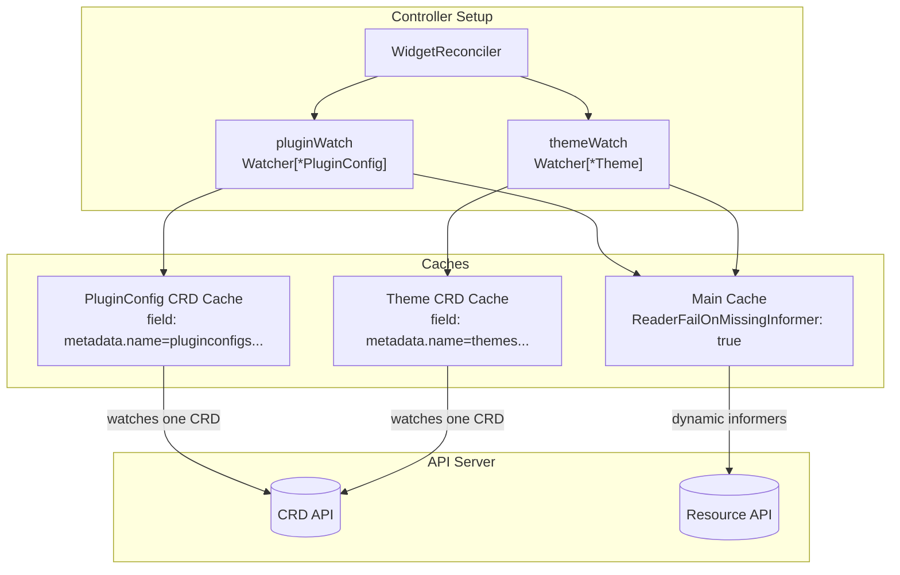
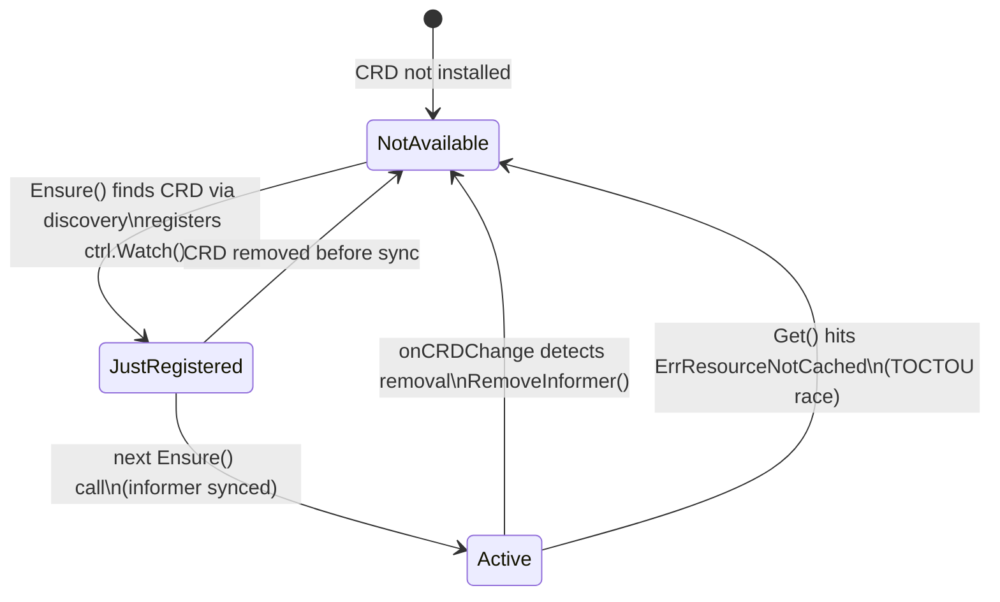
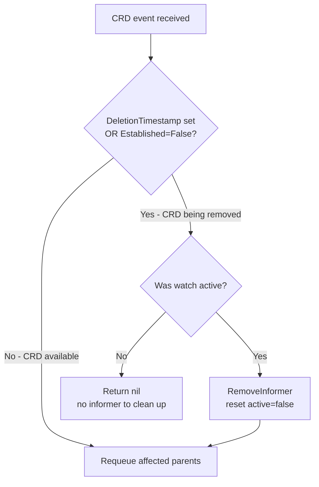

# Architecture

## The Problem

Kubernetes controllers that depend on optional CRDs have a startup problem. Most controllers check CRD availability once during initialization. Install the CRD later? Restart the controller. Remove it? The informer leaks, retrying list/watch against a dead API forever.

This gets worse when you have *multiple* optional CRDs. Think of a platform controller that optionally integrates with KEDA, Prometheus Operator, or Istio - each may or may not be installed, and any of them could appear or vanish at runtime.

The `dynamicwatch` package solves this: one `Watcher[T]` per optional CRD, each tracking its own CRD's lifecycle - registering informers when the CRD appears, tearing them down when it disappears. No restarts.

## How It Fits Together



The Widget controller owns two Watchers. Each Watcher has a dedicated cache that watches *only* its target CRD (via server-side field selector on `metadata.name`). When the Watcher detects the CRD appearing, it registers an informer on the main cache for the actual resource type. When the CRD disappears, it tears that informer down.

## Watcher Lifecycle

Each Watcher moves through three states, driven by CRD events and reconcile calls:



- **NotAvailable** - CRD is not installed, or the watch was torn down after removal.
- **JustRegistered** - `Ensure()` just called `ctrl.Watch()`. The informer cache hasn't synced yet. Callers should requeue with a short delay.
- **Active** - informer is synced and serving reads. Business as usual.

## The Watcher API

A Watcher is built with a fluent API that mirrors controller-runtime's builder:

```go
w, err := dynamicwatch.For[*v1alpha1.PluginConfig](mgr, "pluginconfigs.demo.example.com").
    EnqueueOnObjectChange(r.pluginConfigToWidgets).  // PluginConfig created/updated/deleted
    EnqueueOnCRDChange(r.allWidgetsWithPluginRef).    // CRD itself appears/disappears
    Build()
```

The Watcher implements `source.SyncingSource`, so it plugs directly into the builder:

```go
ctrl.NewControllerManagedBy(mgr).
    For(&v1alpha1.Widget{}).
    WatchesRawSource(w).
    Complete(r)
```

The controller framework calls `Start` and `WaitForSync` automatically. Inside `Start`, the Watcher creates and starts a CRD sub-source that drives `onCRDChange`. The queue and context are stored for later use when `Ensure` starts object sub-sources lazily at runtime.

During reconciliation, the controller calls `Ensure()` to check/register the watch, then `Get()` to read through the cache:

```go
switch r.pluginWatch.Ensure(ctx) {
case dynamicwatch.JustRegistered:
    return ctrl.Result{RequeueAfter: time.Second}, nil
case dynamicwatch.NotAvailable:
    widget.MarkPluginCRDNotAvailable()
    return ctrl.Result{}, nil
case dynamicwatch.Active:
    // proceed
}

plugin := &v1alpha1.PluginConfig{}
if err := r.pluginWatch.Get(ctx, key, plugin); err != nil {
    if errors.Is(err, dynamicwatch.ErrCacheInvalidated) {
        return ctrl.Result{RequeueAfter: time.Second}, nil  // race - requeue
    }
    return ctrl.Result{}, err
}
```

## Key Design Decisions

These are the things that broke along the way. Each one cost at least an hour of staring at goroutine dumps.

### Dedicated cache per Watcher

Each Watcher creates its own `cache.Cache` filtered by `metadata.name` via a server-side field selector:

```go
crdCache, err := cache.New(cfg, cache.Options{
    ByObject: map[client.Object]cache.ByObject{
        &apiextensionsv1.CustomResourceDefinition{}: {
            Field: fields.OneTermEqualSelector("metadata.name", crdName),
        },
    },
})
```

This means multiple Watchers can independently track different CRDs without interfering with each other. The PluginConfig Watcher doesn't see Theme CRD events and vice versa. Each cache is registered with the manager via `mgr.Add()` so it starts and stops with the manager's lifecycle.

### `ReaderFailOnMissingInformer` is not optional

The main cache **must** have `ReaderFailOnMissingInformer: true`. Without it, a `Get()` call after `RemoveInformer()` silently creates a *new* informer for the removed GVK. That informer tries to list/watch against a non-existent API and blocks on `WaitForCacheSync` forever. Your controller worker goroutine is now permanently stuck. Ask me how I know.

With this flag, `Get()` returns `ErrResourceNotCached` instead, which `Watcher.Get()` translates to `ErrCacheInvalidated` - a clean signal to requeue.

### `Build()` not `Complete()`

controller-runtime's builder has two terminal methods: `Complete(r)` and `Build(r)`. `Complete()` doesn't return the `controller.Controller` reference. We need that reference for dynamic `ctrl.Watch()` calls at runtime, so we use `Build()` and wire things up manually via `Register` / `Bind`.

### CRD deletion race

This one is subtle (and took the longest to track down). During CRD deletion, Kubernetes updates the CRD status *before* setting `DeletionTimestamp`. The status update sets `Established=False` and fires a watch event. If you only check `DeletionTimestamp`, that status update event looks like a normal CRD update - the controller re-registers the watch mid-deletion, creating an informer that deadlocks on `WaitForCacheSync`.

The fix checks both signals:

```go
crdRemoved := !crd.DeletionTimestamp.IsZero() || !isCRDEstablished(crd)
```

### Discovery client reuses manager's HTTP client

Each Watcher needs a discovery client for CRD availability checks. Creating a new transport per Watcher would leak connections (not great when you have N optional CRDs). Instead, each Watcher shares the manager's HTTP client:

```go
dc, err := discovery.NewDiscoveryClientForConfigAndClient(mgr.GetConfig(), mgr.GetHTTPClient())
```

The discovery client is deliberately uncached (not the default cached variant) to avoid the ~10 minute TTL that would delay CRD detection.

### TOCTOU between `Ensure()` and `Get()`

There's an inherent race: the CRD could be removed between `Ensure()` returning `Active` and the subsequent `Get()` call. When this happens, `RemoveInformer` fires from `onCRDChange`, and `Get()` hits `ErrResourceNotCached`.

`Watcher.Get()` catches this, resets its internal state, and returns `ErrCacheInvalidated`. The caller requeues, and the next `Ensure()` sees `NotAvailable`. No deadlock, no panic - just a clean retry. (This race is rare in practice but trivial to hit in tests with rapid CRD install/remove cycles.)

## CRD Event Handling

The `onCRDChange` handler deserves a closer look because it handles several edge cases:



When the watch was never active (CRD installed and removed before any reconcile called `Ensure()`), the handler returns nil. There are no informers to tear down and no cached objects to invalidate, so requeueing would just cause unnecessary reconciles that hit `Ensure()` and get `NotAvailable`.

## The Example Controller

The Widget reconciler demonstrates the pattern with two independent optional CRDs:

- **Widget** (always installed) - the primary resource, has optional `pluginRef` and `themeRef` fields
- **PluginConfig** (optional) - provides a `setting` value
- **Theme** (optional) - provides a `colorScheme` value

Each optional CRD gets its own Watcher, its own status condition (`PluginReady` / `ThemeReady`), and its own set of mapper functions. The two Watchers don't know about each other - you can install PluginConfig without Theme and vice versa. That's the whole point.

Condition management lives on the Widget type itself (methods like `MarkPluginApplied()`, `MarkThemeCRDNotAvailable()`, `RemovePluginCondition()`). Conditions are removed entirely when the corresponding ref field is cleared.

## Testing Strategy

Tests use envtest with Ginkgo v2 and run in three modes:

| Mode | What it tests | How to run |
|------|--------------|------------|
| envtest (default) | In-process manager + embedded apiserver | `make test` |
| USE_EXISTING_CLUSTER | In-process manager + real cluster | `make test-int` |
| DEPLOYED_MANAGER | Deployed pod + real cluster (full e2e) | `make test-e2e` |

Key testing details:

- **Only Widget CRD installed at startup.** PluginConfig and Theme CRDs are installed and removed dynamically during tests to exercise the full lifecycle.
- **`directClient` bypasses the manager cache.** CRD operations (install/remove) use an uncached client because the manager's cache has `ReaderFailOnMissingInformer: true` and CRD informers live in each Watcher's dedicated cache.
- **Lifecycle is the test.** The interesting tests are the dynamic ones: CRD not available, CRD install at runtime, CRD removal, add/remove/re-add cycle, and both Watchers operating simultaneously with independent conditions. If you can install and remove a CRD three times without the controller hanging, you're in good shape.

## Project Layout

```
pkg/dynamicwatch/
    watcher.go           # Watcher type, builder, CRD lifecycle management
    watcher_test.go      # Unit tests with fake cache and informer
    export_test.go       # Test helpers (state inspection, crdAvailable override)

internal/controller/
    widget_controller.go # Reconciler + SetupWithManager wiring
    fixture/             # Test builders, matchers, project root helper

api/v1alpha1/
    widget_types.go      # Widget CRD (primary)
    widget_lifecycle.go  # Condition management methods
    pluginconfig_types.go # PluginConfig CRD (optional)
    theme_types.go       # Theme CRD (optional)
```

The best starting point is `pkg/dynamicwatch/watcher.go` - that's where all the interesting decisions live. The controller in `internal/controller/` is intentionally boring. If consuming the library is boring, the library is doing its job.
